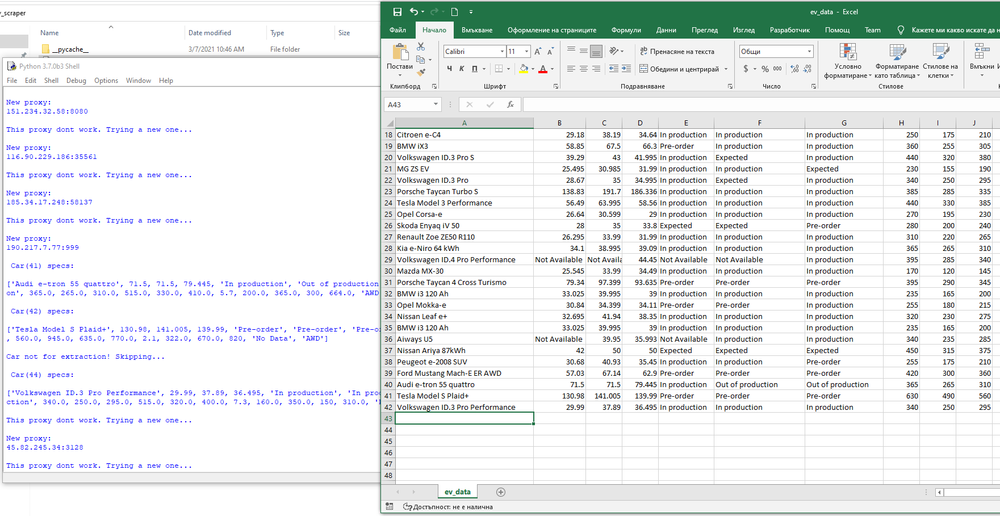

Scraper that collects specific specifications of electric vehicles (Model, torque, acceleration etc.) of [ev database](https://ev-database.org/), cleans the data and generates CSV file.
Since the whole scraping takes a while (20-30 minutes), whenever the script is terminated the data collected untill this moment is stored in the CSV and
can be resumed the next time the script is runed with a change of a variable.

The script uses custom module with the intent of avoiding website defence mechanisms of detecting and stoping scrapers. Proxy rotation, intented delay between requests and change of user agents.

## Notes:
- If there is an error related to the timeout of page request, run the script again.
- Other than the first note, if there are any other problems while running the script that means either the ev website or proxy website's layout is changed and the script will scrape irrelevant data.
